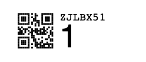

# RaceResult ActiveTransponder label generator for Avery/Zweckform labels

[RaceResult](https://www.raceresult.com) [ActiveTransponders](https://www.raceresult.com/de-de/shop/ActiveTransponders.php) allow tracking in sport and motorsport events.

The transponders have a field where you can add a Avery/Zweckform 4731 label:

You can have 189 labels on one sheet (7x27). The script creates multpiple PDF pages if needed.

**Printing should be done using 100% print option. Otherwise labels will not fit.**

One single label contains the race number, transponder id and qr code of the transponder id. It looks like:

## Options

You can give the following options to the script:

 * -n - Number of labels to print (Default 189, one A4 sheet)
 * -o - Offset for label race numbers (Default starting at 1)
 * -p - Placement offset leaving specified number of labels free (Default 0), allows for reuse of one sheet if you have less than 189 labels to print
 * -f - Output filename (Default chiplabels.pdf)
 * -c - RaceResult CSV Chipfile containing race number and Chip ID seperated by ; (no default, mandatory)

Race numbers not present in Chipfile will only have the number printd

# Credits

This is based on the [work from gitolicious](https://github.com/gitolicious/avery-asn), which is based on the [work from timrprobocom](https://gist.github.com/timrprobocom/3946aca8ab75df8267bbf892a427a1b7)
